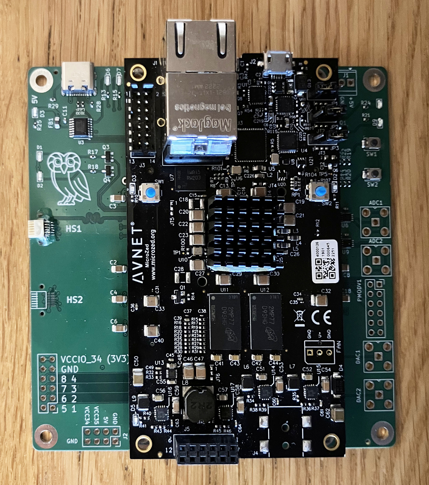
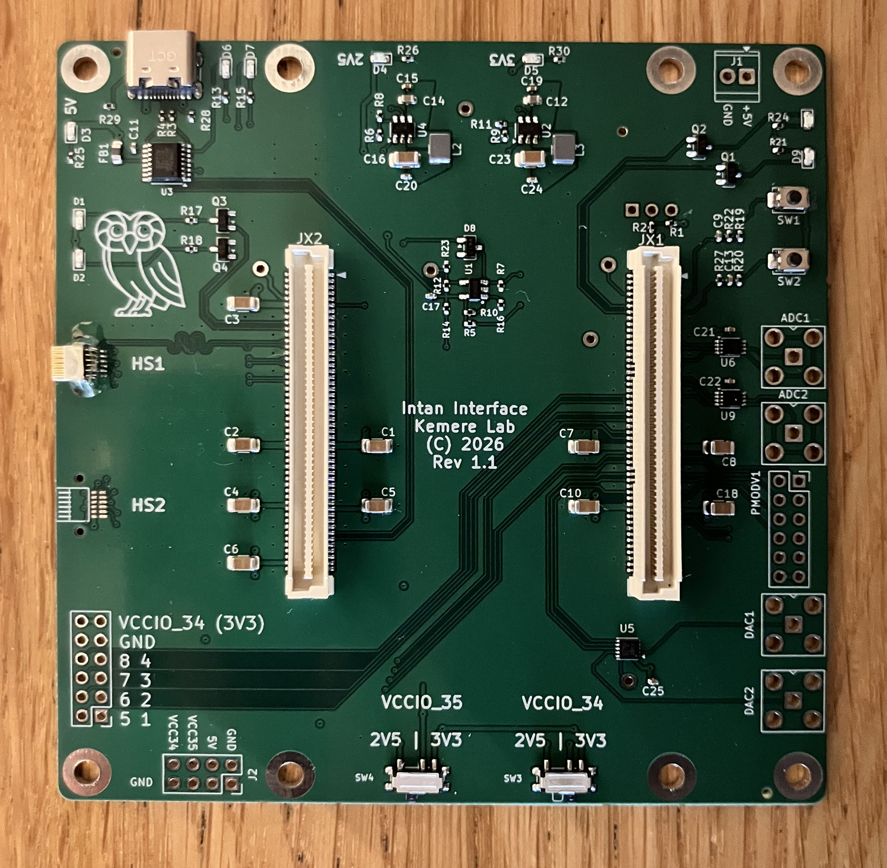
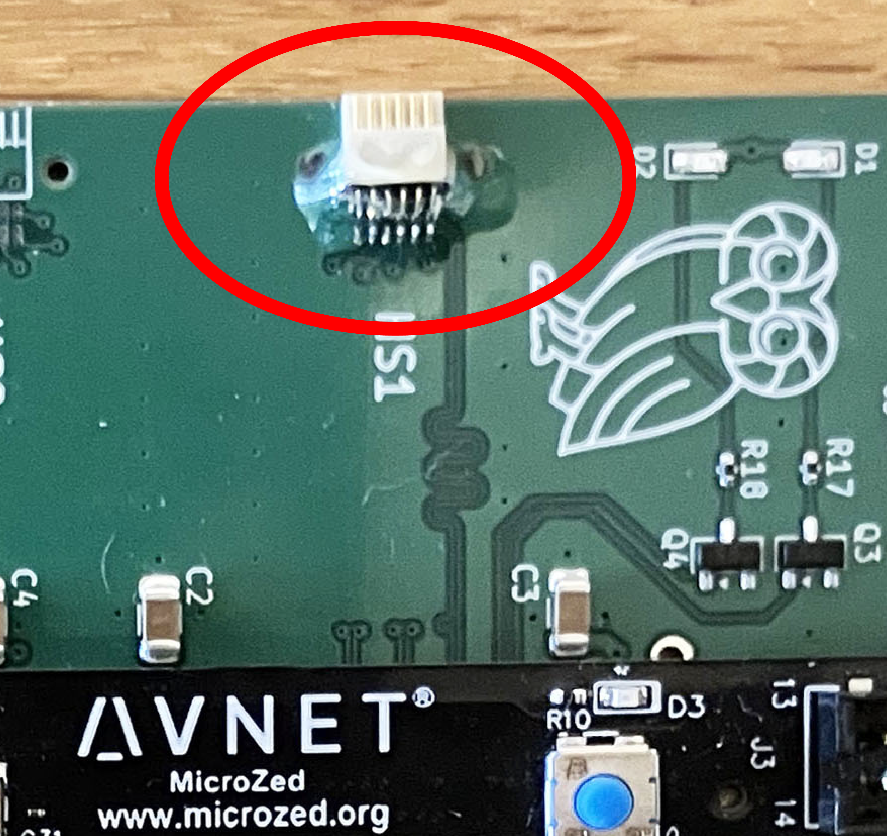

# MicroZedIntanInterface
Verilog and firmware for an FPGA interface to the Intan Data Acquisition protocol. We leverage the MicroZed 
Zynq7000 developmment board. The Zynq7020 model combines dual Arm A9 processors with a reasonably sized
programmable logic fabric, and the development board adds DDR memory and a Gigabit Ethernet interface. We have
implemented firmware which handles the single and DDR data interfaces for two RHD2000-style ICs, connected 
via a single Intan-standard Omnetics 12 pin cable. The interface streams data (up to 128 channels at 30ksps), 
with a  user-programmable delay on the data lines and controlled via a TCP interface.

The MicroZed modules are available for about $300 at 
[Newark](https://www.newark.com/avnet/aes-z7mb-7z020-som-i-g-rev-h/eval-brd-32bit-fpga-arm-cortex/dp/62AJ7410) 
as well as other sources. Note that the Zynq 7010 should likely also work for this project. 

The [carrier PCB](pcb/KiCad-Project/) design has been manufactured at JLCPCB. 

Here is the carrier PCB bare and with the MicroZed installed.
<p align="center">
  
  
</p>

### Omnetics connector epoxy

The Omnetics 12-pin connector for the Intan interface **requires epoxy reinforcement**. The
pin-to-solder-pad connection alone is not robust enough to survive repeated mating and
unmating. Apply several layers of UV-curing epoxy (we use Bondic) to bond the connector
body to the PCB; through-holes placed near the connector are provided specifically to anchor
the epoxy. **Keep epoxy clear of the pins and the mating face of the connector.**

<p align="center">
  
</p>

## Firmware

### Steps to building and testing
0. Set the path up for Vivado command line - `source ~/Xilinx/2025.1/Vivado/settings64.sh`
1. Create a Vivado project  - `vivado -mode batch -source scripts/create_vivado_project.tcl`. This will
  create a Vivado project that you can open in the `<repository>/vivado_project/` directory.

**NOTE** I think that the only place the part is specified is in the `scripts/create_project.tcl` file.
(I made the project with a `xc7z020clg400-1`. I think you should be able to change this to 
`xc7z010clg400-1` safely????)

#### Building from Within Vivado
1. Synthesis, Implementation, and Generate Bitstream - can simply click `Generate Bitstream` and these steps should be taken care of.
2. `File->Export->Export Hardware`, choose "Include Bitstream" option!

#### Alternative to building from within Vivado
1. Run `vivado -mode batch -source scripts/build_bitstream.tcl`. This should end up with the exported hardware in `vivado_project/klab.xsa`


#### Creating a Vitis project
1. Set the path for Vitis command line - `source ~/Xilinx/2025.1/Vitis/settings64.sh`
2. From the root directory of the repository run `vitis -s scripts/create_vitis_project.py`. This will
  create a Vitis project that you can open in the `<repository>/vitis_project`. The script automatically
  sources the hardware file that was created in the previous step with Vivado. It by default also builds
  this project.

#### Create a bootable SD card
Run `bootgen -image scripts/boot.bif -o BOOT.bin -w` and copy the resulting `BOOT.bin` file to the FAT32
formatted `Boot` partition on your SD card.

A prebuilt, current image is also kept at [`blobs/BOOT.bin`](blobs/BOOT.bin) — copy that
straight to the `Boot` partition if you don't want to rebuild. After **any PL change** the
bitstream must be re-staged into the path referenced by `scripts/boot.bif` before running
`bootgen` (see the build notes in [`CLAUDE.md`](CLAUDE.md)).

## Streaming data to a host

The board boots into a bare-metal application that, once an Ethernet link is up, listens for
**TCP control** commands on port 6000 and streams acquisition data over **UDP** on port 5000.
The default device IP is `192.168.18.10` (configure your host on the same subnet). Two host
clients speak this protocol:

### `remote/net.py` — reference client (Python)

A single-file command-line client used for bring-up, cable/phase auto-detection, and testing:

```bash
cd remote && python3 net.py        # connects to ZYNQ_IP (default 192.168.18.10)
```

It auto-detects your host IP and reconfigures the board's UDP destination over TCP, then drops
into an interactive prompt (`start`, `stop`, `auto_cable_detect`, `get_status`, plus the aux
command-bank / fast-settle / register-access commands — type `help`). Edit `ZYNQ_IP`/ports at
the top of the file if your board address differs. `net.py` is the canonical, human-readable
reference for the TCP command set and the UDP packet format.

### OpenEphys GUI — `ephys-socket` plugin

For real recording and visualization, use the companion **[ephys-socket](https://github.com/ckemere/ephys-socket)**
plugin — a fork of the OpenEphys "Ephys Socket" `DataThread` that speaks this board's protocol
directly (TCP control + UDP capture → OpenEphys data buffer). It surfaces chip auto-detection,
neural + aux/accelerometer channels (faithfully scaled to match the OpenEphys acquisition-board
plugin), and in-GUI controls for amplifier fast settle and the programmable aux command banks.

<p align="center">
  
</p>

Typical flow:
1. Build/install the plugin against your OpenEphys `plugin-GUI` (see that repo's README).
2. In OpenEphys, drag **Intan Socket** into the signal chain as the source.
3. Set the device IP in the editor, click **CONNECT**, then **RESCAN** to detect chips and the
   optimal cable phase.
4. Press play to stream; use the **STATUS**, **SETTLE**, and **AUX SEQ** buttons to exercise
   fast settle and the banked aux/accelerometer features at run time.

The board firmware (`firmware/`), `remote/net.py`, and the plugin are the **three consumers of
the same register/packet contract** — keep them in sync when changing the protocol (see
[`CLAUDE.md`](CLAUDE.md) and [`docs/command-bank-design.md`](docs/command-bank-design.md)).

