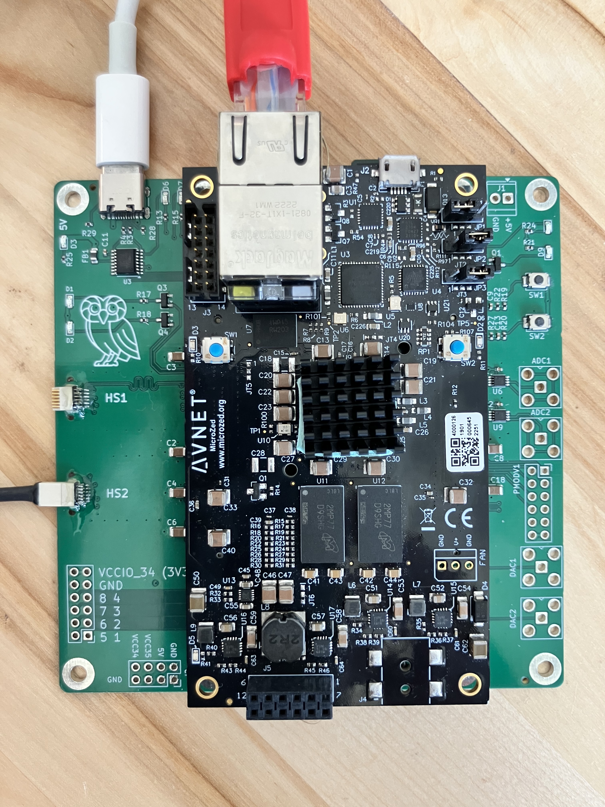

# MicroZedIntanInterface

An FPGA data-acquisition interface for **Intan RHD2000-style neural recording chips**, built
on a **MicroZed** (Xilinx Zynq-7020) with a custom carrier PCB. The PL talks to up to two
RHD2000 chips over a DDR SPI protocol; the PS streams the data over the network.

- Up to **128 channels @ 30 ksps** (two Intan-standard 12-pin Omnetics cables, single + DDR).
- A user-programmable per-cable phase delay compensates for cable length.
- **TCP control** (port 6000) + **UDP data stream** (port 5000, ~9 MB/s).
- Data path: `Intan ──SPI(DDR)──► PL ──BRAM──► (AXI CDMA) ──► PS ──UDP──► host`.

MicroZed SOMs are ~$300 (e.g. [Newark](https://www.newark.com/avnet/aes-z7mb-7z020-som-i-g-rev-h/eval-brd-32bit-fpga-arm-cortex/dp/62AJ7410)).
The [carrier PCB](pcb/KiCad-Project/) is manufactured at JLCPCB.

  
  

## Documentation

- **[Getting up and running](docs/getting-started.md)** — assembling the board (Omnetics
  epoxy), the MicroZed boot jumpers, copying the boot image to SD, and building from source.
- **[Command & packet structure](docs/protocol.md)** — the TCP command set, the UDP packet
  format, and the register map.
- **[CLAUDE.md](CLAUDE.md)** — architecture, build commands, and conventions for developers.
- **[ROADMAP.md](ROADMAP.md)** — status and planned work. **[overview.txt](overview.txt)** —
  the deeper architectural narrative.

## Host software

The board's protocol has two reference clients (both speak TCP control + UDP capture):

- **`remote/net.py`** — a single-file Python client for bring-up, cable/phase auto-detection,
  and testing. The human-readable reference for the command set and packet format.
- **[ephys-socket](https://github.com/ckemere/ephys-socket)** — the OpenEphys GUI plugin for
  real recording and visualization (neural + aux/accelerometer channels, fast settle, banked
  aux commands).

  

The firmware (`firmware/`), `remote/net.py`, and the plugin are the **three consumers of the
same register/packet contract** — keep them in sync when changing the protocol.
